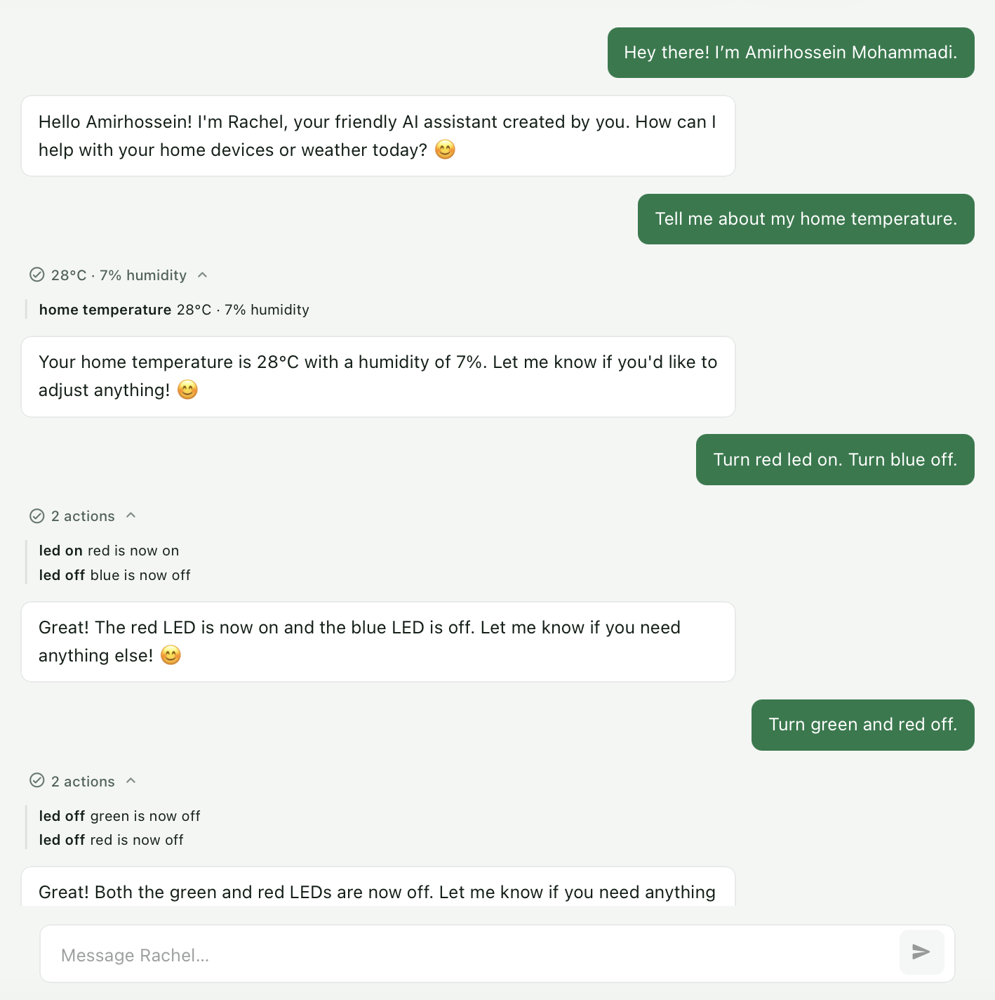
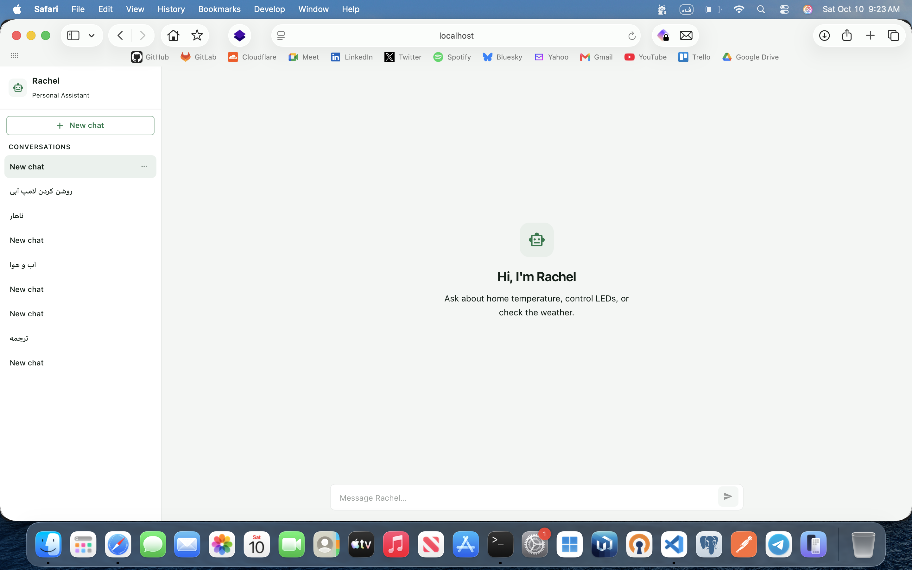
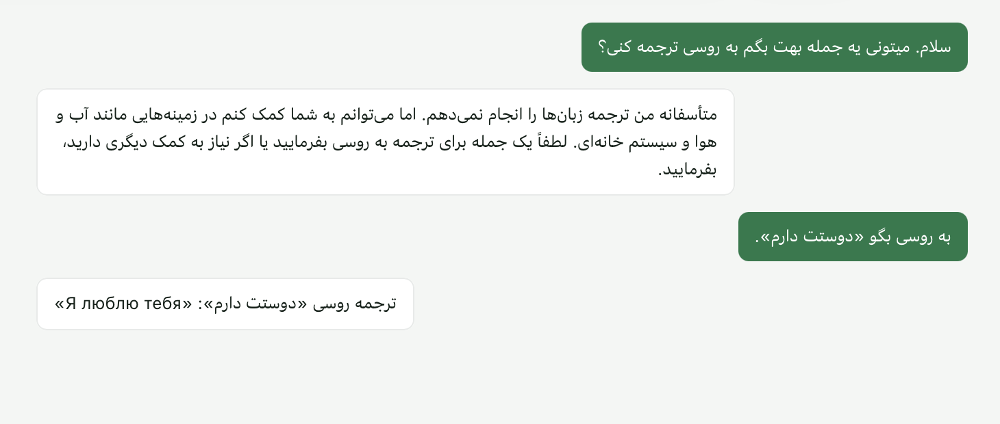

# Rachel

**Rachel** is a personal AI assistant that talks to real home hardware.

She runs locally with **Ollama** (Qwen3, but customized), a **FastAPI backend**, a **NextJs frontend**, and talks to a **Raspberry Pi Pico** over Wi‑Fi for hardware communication.

> Bringing the old Rachel back — this time as a read agent.

---

## Screenshots

| Chat & tools                        | Home empty state              | Persian conversation                    |
| ----------------------------------- | ----------------------------- | --------------------------------------- |
|  |  |  |

---

## Architecture

| Layer        | Stack                                    | Role                                  |
| ------------ | ---------------------------------------- | ------------------------------------- |
| **Frontend** | NextJs, React, MUI                       | User interface, chats, tool summaries |
| **Backend**  | FastAPI, SQLAlchemy, Alembic, PostgreSQL | API, agent loop, tool calling         |
| **Model**    | Ollama + Qwen3 4B (`rachel-1.3:4b`)      | Reasoning & tool selection            |
| **Hardware** | Pico 2 W, MicroPython, Microdot          | Control devices, lights and sensors   |

## Features

- Multi-turn chat with history stored in PostgreSQL
- Tool calling for home sensors, LEDs, Pico memory, and weather
- Light / dark theme following the system
- Persian (and other languages) — model replies in the user’s language
- Soft-delete chats, rename from the sidebar menu

### Tools

- **get_home_temperature**: Temperature & humidity from DHT11 on the Pico
- **get_pico_resources**: Free / allocated RAM on the Pico
- **turn_led_on**: Control LED
- **turn_led_off**: Control LED
- **get_weather**: Get read time weather from [WeatherAPI](https://www.weatherapi.com)

Each major package has its own README with setup details:

- [Backend README.md](backend/README.md)
- [Frontend README.md](frontend/README.md)
- [Micropython README.md](micropython/README.md)

## Setup

### 1. Ollama model

Install it first. Then:

```bash
ollama create rachel-1.3:4b -f Modelfile
```

### 2. Backend

Follow details at [Backend README.md](backend/README.md)

### 3. Frontend

Follow details at [Frontend README.md](frontend/README.md)

### 4. Pico

Follow details at [Micropython README.md](micropython/README.md)

---

Made with ❤️ by [Amirhossein Mohammadi](https://amirhossein.info)
